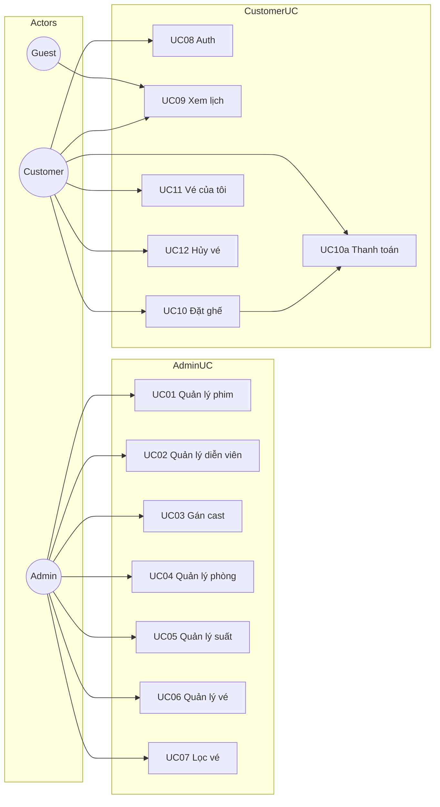
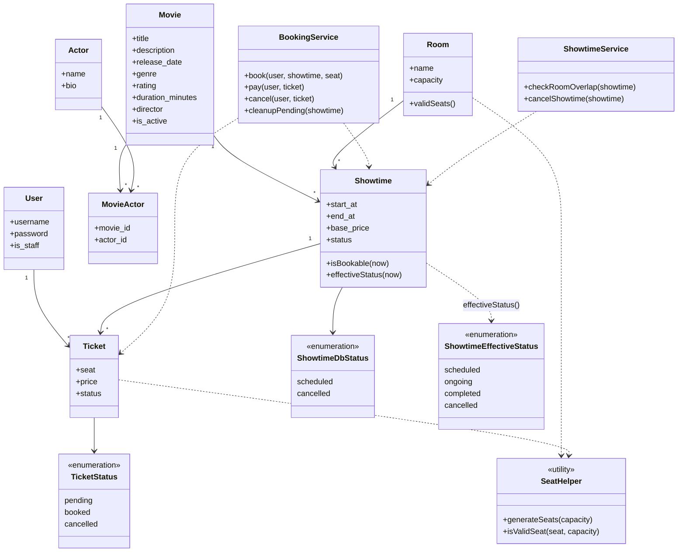
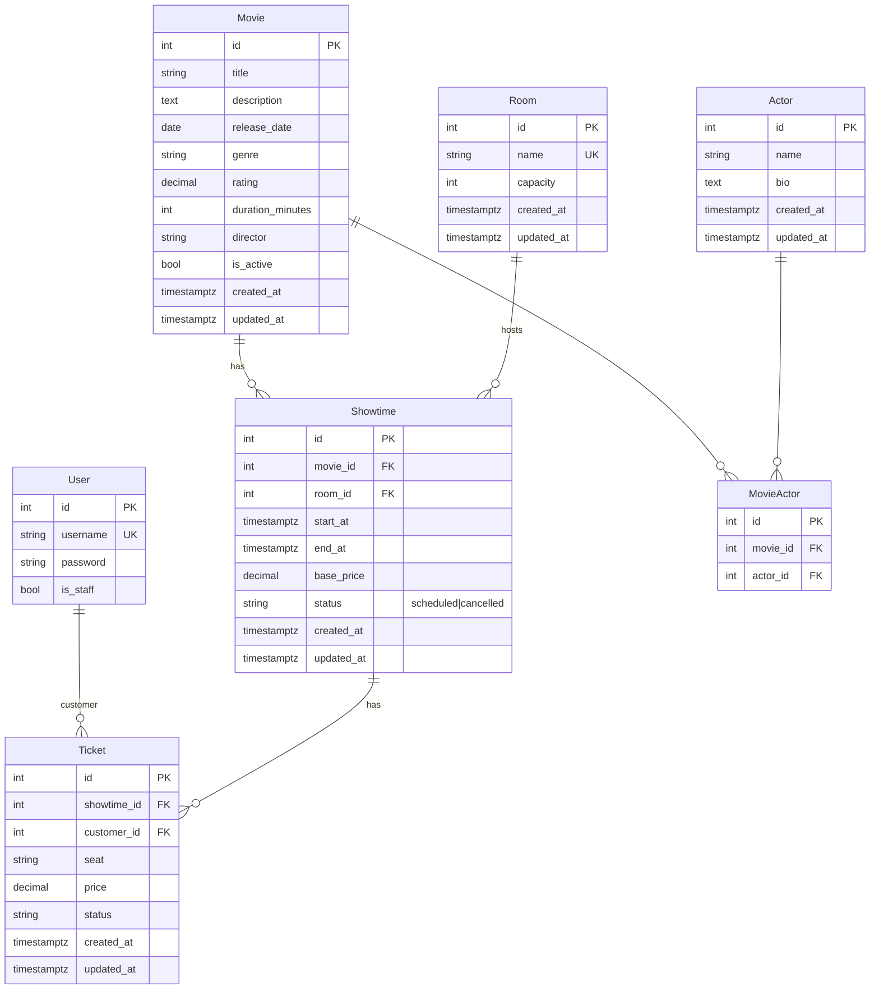
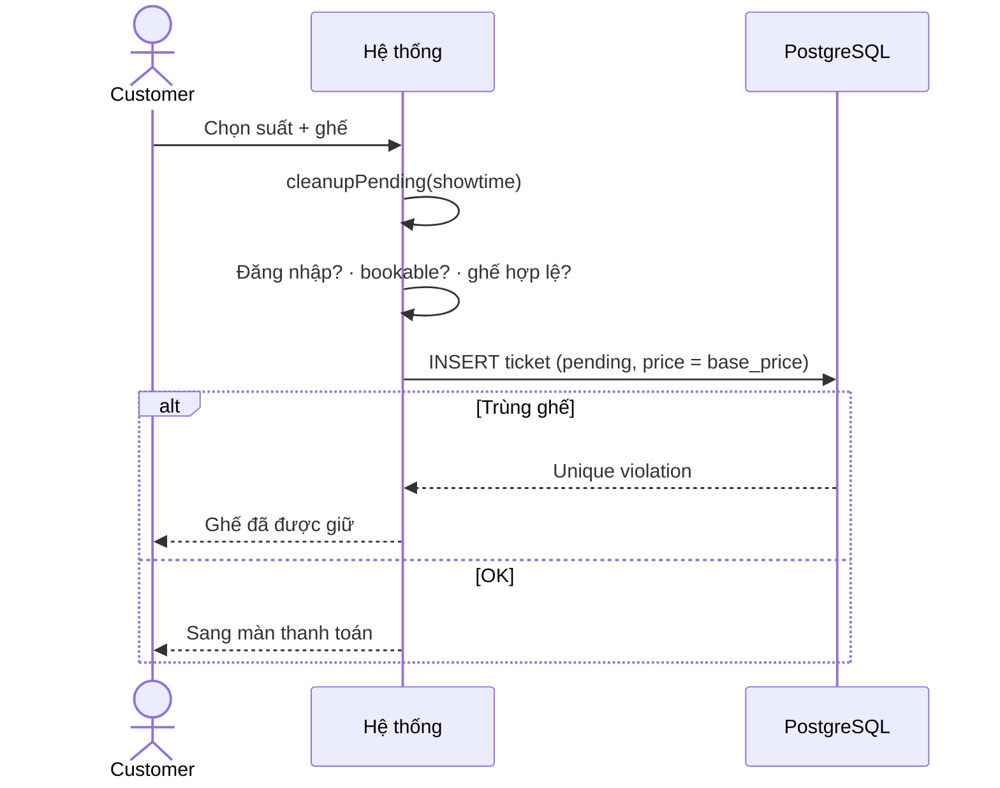
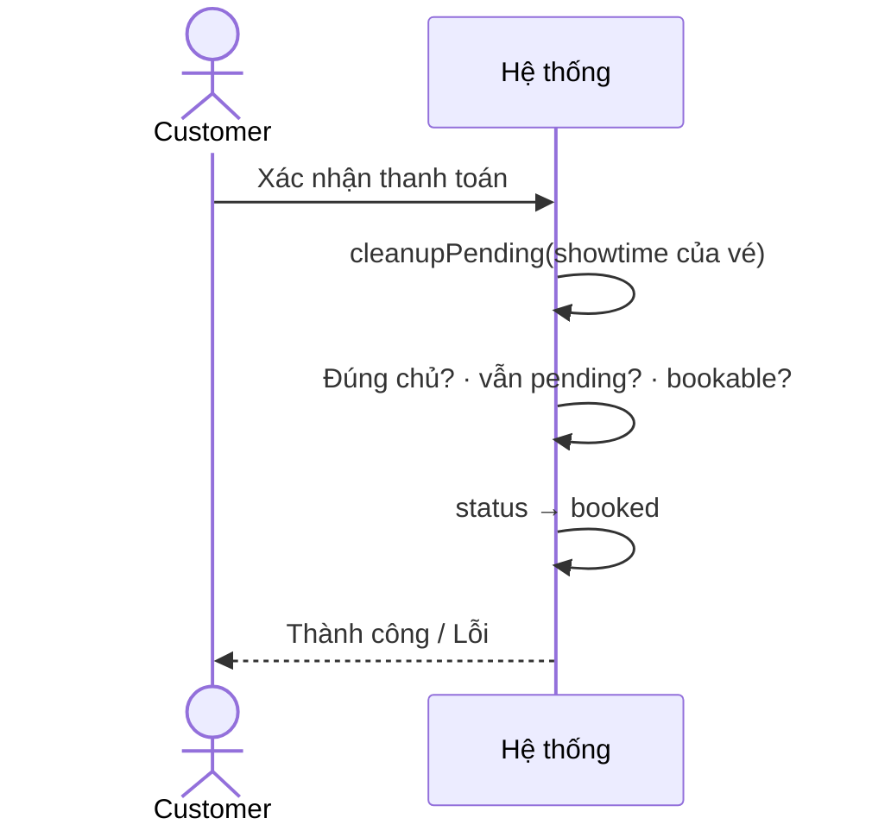
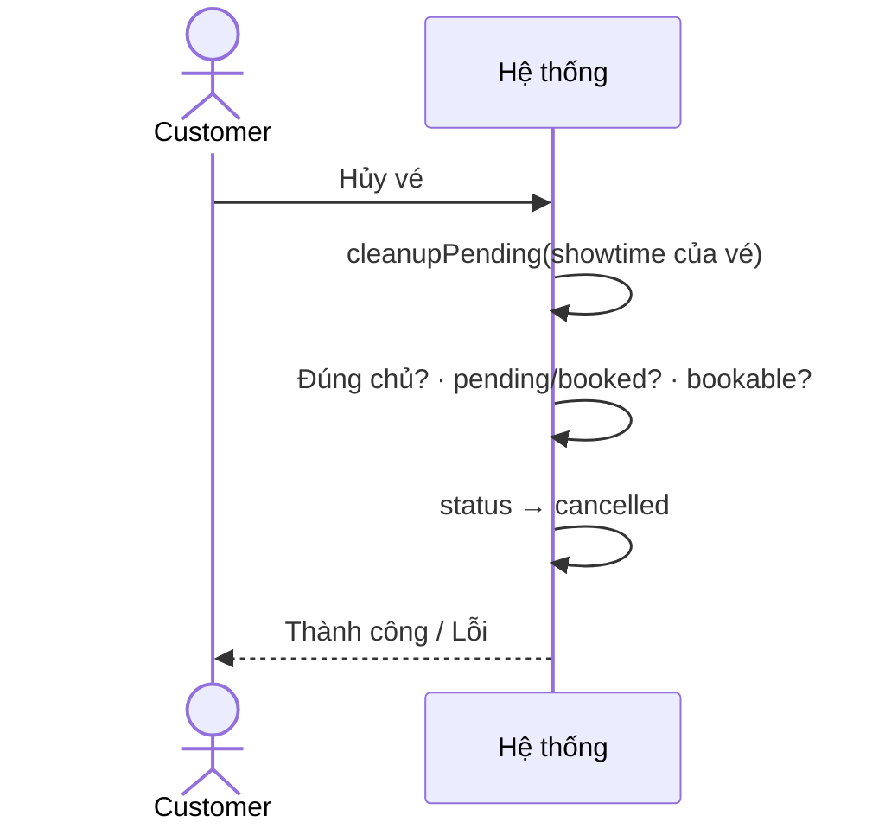
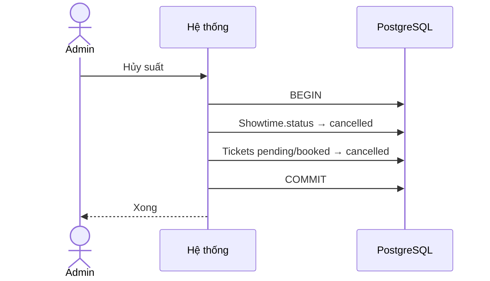
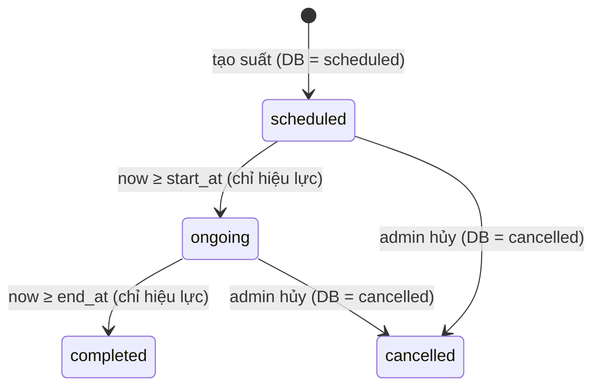
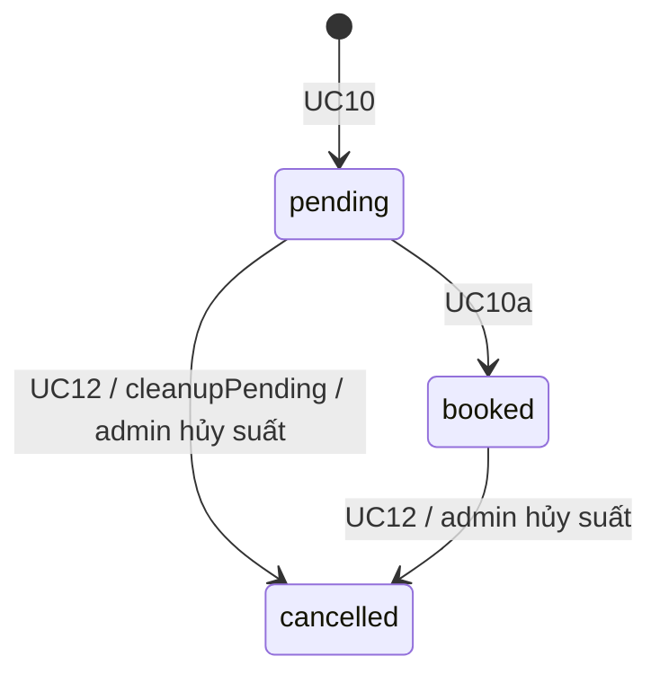
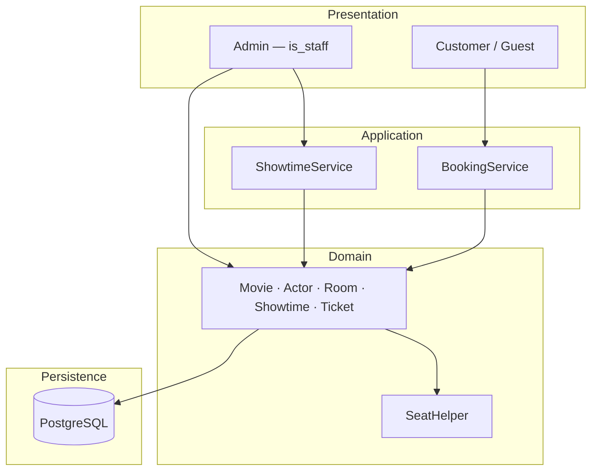

# Phân tích thiết kế — Cinema

Hệ thống đặt vé theo **suất chiếu** (Phim + Phòng + giờ).

| | |
|--|--|
| Vai trò | Admin (`User.is_staff`) · Customer (đã đăng nhập) · Guest |
| CSDL | PostgreSQL |
| Thời gian | Lưu `timestamptz` (UTC) · hiển thị giờ VN |

| Vai trò | Chức năng |
|---------|-----------|
| Admin | `is_staff=True` — quản lý phim, diễn viên, phòng, suất, vé |
| Guest | Xem lịch chiếu |
| Customer | Đăng ký/đăng nhập · xem lịch · đặt ghế · thanh toán giả lập · xem/hủy vé |

---

## 1. Use Case

### 1.1 Sơ đồ Use Case



### 1.2 Danh sách Use Case

| ID | Actor | Mô tả |
|----|-------|-------|
| UC01 | Admin | CRUD phim, bật/tắt hiển thị |
| UC02 | Admin | CRUD diễn viên |
| UC03 | Admin | Gán diễn viên–phim (cặp duy nhất) |
| UC04 | Admin | CRUD phòng chiếu |
| UC05 | Admin | CRUD suất chiếu, hủy suất (cascade vé) |
| UC06 | Admin | Xem vé; chỉ được đổi `Ticket.status` (không đổi ghế / suất / giá / khách) |
| UC07 | Admin | Lọc vé theo suất, trạng thái |
| UC08 | Customer | Đăng ký / đăng nhập / đăng xuất |
| UC09 | Guest, Customer | Xem lịch chiếu |
| UC10 | Customer | Đặt 1 ghế → vé `pending` |
| UC10a | Customer | Thanh toán giả lập → `booked` |
| UC11 | Customer | Xem vé của tôi |
| UC12 | Customer | Hủy vé `pending` / `booked` |

---

## 2. Class Diagram



| Thành phần | Trách nhiệm |
|------------|-------------|
| Model | Dữ liệu, validate field |
| `SeatHelper` | Sinh / kiểm tra mã ghế (10 ghế/hàng, hàng A–Z) |
| `Showtime.isBookable(now)` | `status != cancelled` ∧ `start_at > now` |
| `Showtime.effectiveStatus(now)` | Suy `scheduled`/`ongoing`/`completed`/`cancelled` (§5.1) |
| `BookingService.cleanupPending` | Hủy `pending` hết hạn **hoặc** khi suất không bookable |
| `BookingService` | `book` / `pay` / `cancel` — luôn gọi `cleanupPending` trước khi kiểm tra |
| `ShowtimeService` | Trùng lịch phòng · hủy suất cascade |

---

## 3. ERD



### 3.1 Quan hệ & ràng buộc

| Quan hệ | Cardinality | Ghi chú |
|---------|-------------|---------|
| User → Ticket | 1:N | `customer_id` |
| Movie → Showtime | 1:N | |
| Room → Showtime | 1:N | |
| Showtime → Ticket | 1:N | |
| Movie ↔ Actor | M:N | qua `MovieActor` |

| Bảng | Ràng buộc |
|------|-----------|
| MovieActor | UNIQUE `(movie_id, actor_id)` |
| Room | UNIQUE `name` · CHECK capacity 1–260 |
| Movie | CHECK rating 0–10 · CHECK duration ≥ 1 |
| Showtime | CHECK `end_at` > `start_at` · CHECK `base_price` ≥ 0 · UNIQUE `(room_id, start_at)` · CHECK status ∈ (`scheduled`, `cancelled`) |
| Ticket | Partial unique: UNIQUE `(showtime_id, seat)` WHERE status IN (`pending`, `booked`) · INDEX `(showtime_id, status)` · INDEX `(status, created_at)` |
| FK | RESTRICT — không xóa cha khi còn con |

| Enum (DB) | Giá trị |
|-----------|---------|
| `Showtime.status` | **`scheduled` · `cancelled`** (chỉ 2 giá trị lưu DB) |
| `Ticket.status` | `pending` · `booked` · `cancelled` |

| Snapshot | Nguồn | Khi nào |
|----------|--------|---------|
| `Showtime.end_at` | `start_at` + duration phim | Tạo / sửa suất |
| `Ticket.price` | `Showtime.base_price` | Đặt ghế (UC10) |

Kiểu cột: tiền `NUMERIC(10,2)` · thời gian `TIMESTAMPTZ` · status `VARCHAR` + CHECK.

---

## 4. Sequence Diagram

### 4.1 Đặt ghế (UC10)



### 4.2 Thanh toán giả lập (UC10a)



### 4.3 Hủy vé (UC12)



### 4.4 Admin hủy suất (UC05)



---

## 5. State Diagram

### 5.1 Suất chiếu — chốt mô hình (A)

**DB chỉ lưu 2 giá trị:** `scheduled` | `cancelled`.  
**Hiệu lực hiển thị / rule:** `effectiveStatus(now)` suy ra 4 trạng thái — không dùng cron.

```text
effectiveStatus(now):
  if status == cancelled           → cancelled
  elif now < start_at              → scheduled
  elif now < end_at                → ongoing
  else                             → completed
```



| effectiveStatus | Đặt ghế / Pay / Hủy vé user |
|-----------------|------------------------------|
| scheduled | Cho phép (`isBookable`) |
| ongoing · completed · cancelled | Không |

### 5.2 Vé



**`cleanupPending(showtime)`** (gọi trong book / pay / cancel / xem ghế):

1. Mọi vé `pending` của suất có `created_at` + 10 phút ≤ now → `cancelled`  
2. Nếu suất **không bookable** → mọi vé `pending` còn lại của suất → `cancelled`

---

## 6. Logic nghiệp vụ

**Bookable** = `status != cancelled` ∧ `start_at` > now  
(= `effectiveStatus` là `scheduled`).

**Suất chưa chiếu** (khi đổi duration phim) = `status != cancelled` ∧ `start_at` > now.  
Suất `cancelled`, hoặc đã tới/qua giờ (`ongoing`/`completed` hiệu lực) **không chặn** đổi duration.

| Rule | Chi tiết |
|------|----------|
| Admin | `User.is_staff == True` |
| Hiện lịch (UC09) | Phim `is_active` · suất bookable |
| Ghế | 10 ghế/hàng (A1–A10, B1–B10, …) · tối đa 26 hàng A–Z · capacity 1–260 · số ghế hợp lệ = capacity |
| Đặt ghế | 1 ghế / lần |
| Giữ chỗ | `pending` tối đa 10 phút; dọn bởi `cleanupPending` |
| Giá vé | Snapshot lúc đặt · không đổi theo suất sau |
| `base_price` | ≥ 0 |
| Trùng lịch phòng | `[start_at, end_at)` không giao suất khác cùng phòng có `status = scheduled` |
| Đổi duration phim | Từ chối nếu còn **suất chưa chiếu**; không recalc `end_at` hàng loạt |
| Sửa suất đã có vé `pending`/`booked` | Không đổi phim / phòng / `start_at` / `base_price` |
| UC06 sửa vé | Chỉ đổi `Ticket.status`; **không** đổi `seat`, suất, giá, khách |
| Hủy suất | DB `cancelled` + cascade vé `pending`/`booked` → `cancelled` |
| Thanh toán | Giả lập trên UI |

---

## 7. Kiến trúc tổng quan



| Lớp | Nội dung |
|-----|----------|
| Presentation | Admin CRUD · lịch · chọn ghế · thanh toán · vé của tôi · auth |
| Application | `BookingService` · `ShowtimeService` |
| Domain | Models + `SeatHelper` |
| Persistence | PostgreSQL · migration · partial unique index |

---

## 8. Kiểm thử

| # | Kịch bản | Mong đợi |
|---|----------|----------|
| 1 | Hai suất cùng phòng trùng giờ | Từ chối |
| 2 | Đổi duration khi còn suất chưa chiếu | Từ chối |
| 3 | Đổi duration khi chỉ còn suất cancelled / đã qua giờ | Cho phép |
| 4 | Hai lần đặt cùng ghế | Một `pending`, một lỗi |
| 5 | Đặt lại ghế đã `cancelled` | Thành công |
| 6 | Pay / hủy sau giờ chiếu | Từ chối |
| 7 | Admin hủy suất | Suất + vé active → `cancelled` |
| 8 | Pay `pending` còn hạn | → `booked` |
| 9 | Pay hết hạn / sai chủ | Từ chối |
| 10 | `pending` > 10 phút (lúc book/pay/cancel/xem ghế) | → `cancelled` |
| 11 | `pending` còn hạn nhưng suất đã bắt đầu (cleanupPending) | → `cancelled` |
| 12 | Hủy `pending` trước pay | → `cancelled` |
| 13 | Admin UC06 đổi ghế vé | Từ chối / không cho sửa field ghế |
