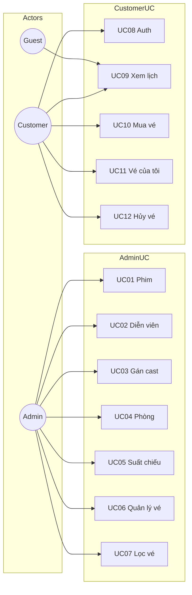
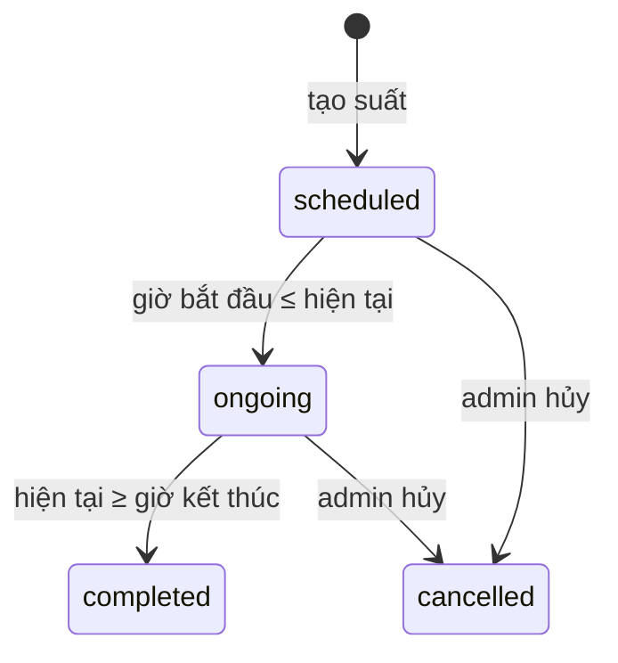
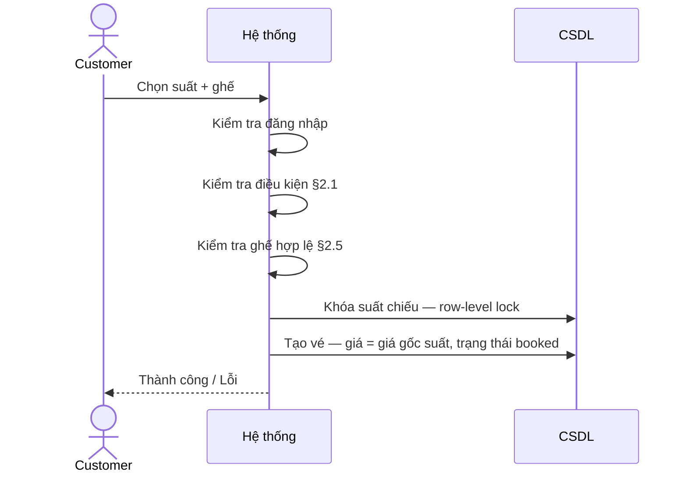
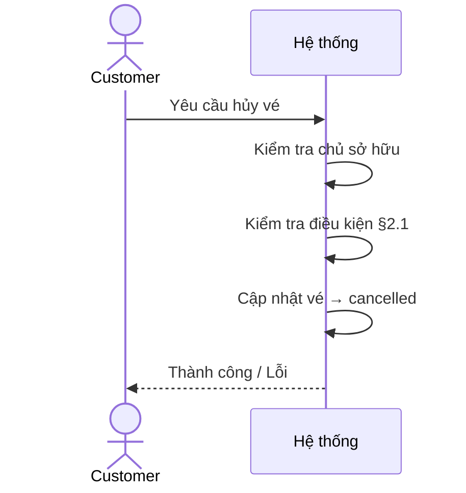
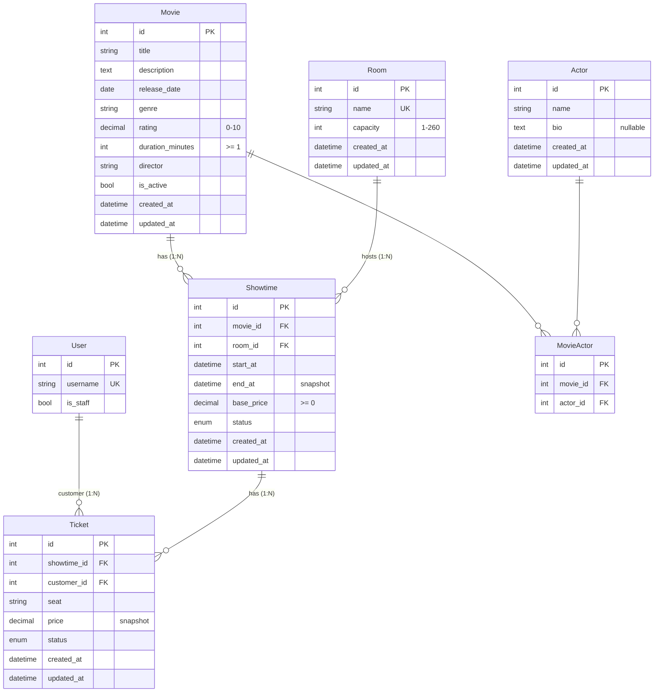
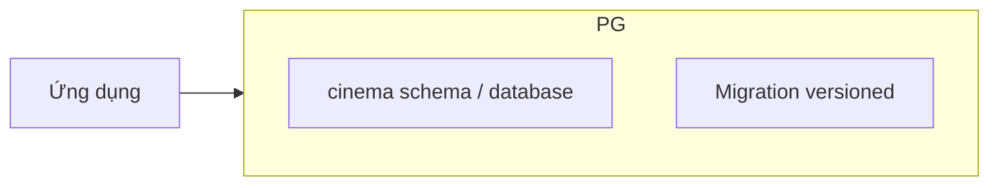
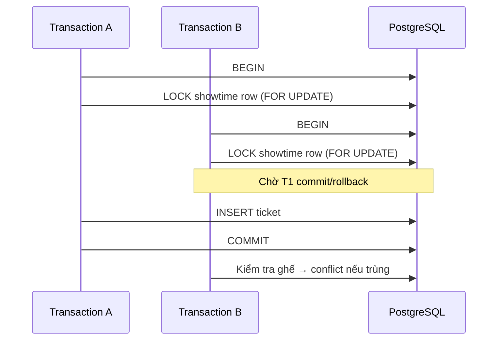
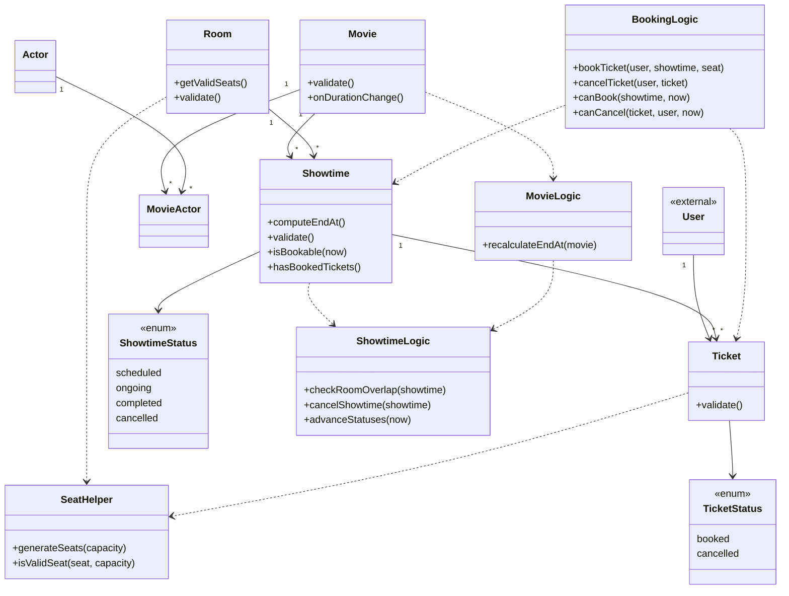
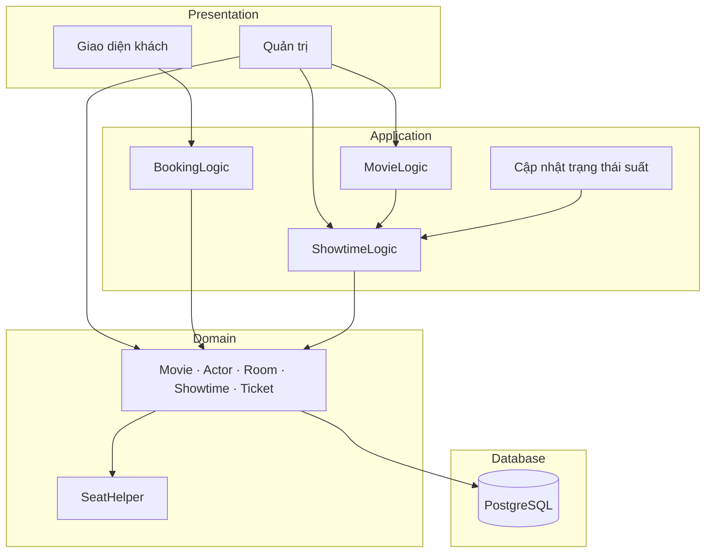

# SPEC — Cinema v1

**Phạm vi:** Đặt vé rạp chiếu — vé gắn **Suất chiếu** (Phim + Phòng + giờ)  
**Vai trò:** Admin · Customer · Guest  
**CSDL:** PostgreSQL
**Thời gian:** Lưu `timestamptz` (UTC) · Hiển thị múi giờ Việt Nam

| Vai trò | Quyền |
|---------|-------|
| Admin | Quản lý catalog, phòng, suất, vé |
| Guest | Xem lịch (UC09) — không đăng nhập |
| Customer | Xem lịch + đăng ký/đăng nhập + mua/hủy/xem vé |

**Quan hệ tổng quát:** Phim N–N Diễn viên · Phim/Phòng 1–N Suất chiếu · Suất chiếu/Khách hàng 1–N Vé

---

## 1. Use case

| ID | Actor | Mô tả | Điều kiện / ghi chú |
|----|-------|-------|---------------------|
| UC01 | Admin | Quản lý Phim, bật/tắt hiển thị | Đổi thời lượng → tính lại giờ kết thúc suất §2.2 |
| UC02 | Admin | Quản lý Diễn viên | — |
| UC03 | Admin | Gán Diễn viên–Phim | Mỗi cặp (phim, diễn viên) duy nhất |
| UC04 | Admin | Quản lý Phòng chiếu | Sức chứa §2.5 |
| UC05 | Admin | Quản lý Suất chiếu, hủy suất | Trùng lịch phòng §2.5 · hủy cascade vé §2.3 |
| UC06 | Admin | Xem / sửa vé | Không xóa cứng khi còn liên kết |
| UC07 | Admin | Lọc vé | Theo suất chiếu, trạng thái vé |
| UC08 | Customer | Đăng ký / đăng nhập / đăng xuất | Không xác minh email |
| UC09 | Guest, Customer | Xem lịch chiếu | §2.1 |
| UC10 | Customer | Mua vé (1 ghế / lần) | §2.4 · bắt buộc đăng nhập |
| UC11 | Customer | Xem vé của tôi | Đăng nhập · danh sách vé thuộc user |
| UC12 | Customer | Hủy vé | §2.4 · không áp dụng khi admin hủy suất |

### Sơ đồ use case

---

## 2. Logic nghiệp vụ

### 2.1 Nguồn sự thật — đặt vé / hủy vé / hiển thị lịch

Luôn kiểm tra **thời gian thực** (giờ bắt đầu, giờ kết thúc, thời điểm hiện tại) **và** trạng thái suất:

| Hành động | Điều kiện |
|-----------|-----------|
| Hiển thị lịch (UC09) | Phim đang active · suất scheduled · giờ bắt đầu > hiện tại |
| Đặt vé (UC10) | Như UC09 · ghế hợp lệ · đã đăng nhập |
| Hủy vé (UC12) | Vé booked · đúng chủ sở hữu · suất scheduled · giờ bắt đầu > hiện tại |
| Cron chậm | Dù DB vẫn ghi scheduled nhưng đã quá giờ bắt đầu → không cho đặt/hủy |

Trạng thái suất dùng để hiển thị, lọc và đánh dấu **cancelled** (admin). Không thay thế kiểm tra thời gian.

### 2.2 Giờ kết thúc suất (snapshot)

| Sự kiện | Cách xác định |
|---------|---------------|
| Tạo / sửa suất (UC05) | Giờ kết thúc = giờ bắt đầu + thời lượng phim (phút) |
| Đổi thời lượng phim (UC01) | Tính lại giờ kết thúc các suất liên quan |

**Tính lại khi đổi thời lượng phim:**

1. Chỉ suất **scheduled** có giờ bắt đầu > hiện tại của phim đó.
2. Mỗi suất: giờ kết thúc mới = giờ bắt đầu + thời lượng mới → kiểm tra trùng lịch phòng §2.5.
3. Nếu bất kỳ suất nào trùng lịch → **từ chối toàn bộ** thay đổi.
4. Suất ongoing / completed / cancelled → giữ nguyên giờ kết thúc (lịch sử).

Toàn bộ trong **một giao dịch** — thành công hết hoặc không đổi gì.

### 2.3 Trạng thái suất chiếu

| Trạng thái | Điều kiện | Đặt vé | Hủy vé (UC12) |
|------------|-----------|--------|---------------|
| scheduled | Giờ bắt đầu > hiện tại | ✅ | ✅ |
| ongoing | Đã bắt đầu, chưa kết thúc | ❌ | ❌ |
| completed | Đã kết thúc | ❌ | ❌ |
| cancelled | Admin hủy (UC05) | ❌ | Cascade: vé booked → cancelled |

**Luồng chuyển trạng thái (tự động):**

- Job định kỳ cập nhật: scheduled → ongoing → completed.
- Admin hủy suất: một giao dịch — đặt cancelled + hủy mọi vé booked.
- Suất đã có vé booked: **không đổi** giờ bắt đầu, phim, phòng, giá gốc — muốn đổi → hủy suất, tạo suất mới.

### 2.4 Luồng đặt vé & hủy vé

**UC10 — Mua vé**

**UC12 — Hủy vé**

| Bước UC10 | Logic |
|-----------|-------|
| 1 | Xác thực user |
| 2 | Kiểm tra suất bookable (§2.1) |
| 3 | Kiểm tra ghế thuộc phòng và chưa booked |
| 4 | Khóa dòng suất chiếu (row-level lock) — tránh 2 user đặt cùng ghế |
| 5 | Ghi vé: giá snapshot từ giá gốc suất |

| Bước UC12 | Logic |
|-----------|-------|
| 1 | Vé thuộc user hiện tại |
| 2 | Vé booked + suất còn bookable (§2.1) |
| 3 | Chuyển trạng thái vé → cancelled |

### 2.5 Ghế, phòng, trùng lịch, giá

| Rule | Chi tiết |
|------|----------|
| Mã ghế | 10 ghế/hàng (A1–A10, B1–B10, …) · tối đa 26 hàng (A–Z) |
| Sức chứa phòng | 1–260 ghế · số ghế hợp lệ = sức chứa phòng |
| Trùng lịch phòng | Khoảng [giờ bắt đầu, giờ kết thúc) không giao suất khác cùng phòng (trừ cancelled) |
| Giá vé | Snapshot giá gốc suất lúc đặt — không đồng bộ ngược |
| Duy nhất suất | Cùng phòng + cùng giờ bắt đầu — duy nhất (kể cả cancelled) |

---

## 3. Database

### 3.1 ERD

### 3.2 Quan hệ & ràng buộc

| Quan hệ | Cardinality | Ghi chú |
|---------|-------------|---------|
| User → Ticket | 1:N | Khách mua nhiều vé |
| Movie → Showtime | 1:N | Một phim nhiều suất |
| Room → Showtime | 1:N | Một phòng nhiều suất |
| Showtime → Ticket | 1:N | Một suất nhiều vé |
| Movie ↔ Actor | M:N | Qua bảng MovieActor |

| Bảng | Ràng buộc |
|------|-----------|
| **MovieActor** | UNIQUE (movie_id, actor_id) |
| **Room** | UNIQUE name · CHECK capacity 1–260 |
| **Movie** | CHECK rating 0–10 · CHECK duration ≥ 1 |
| **Showtime** | CHECK end_at > start_at · UNIQUE (room_id, start_at) · INDEX (status, start_at) |
| **Ticket** | UNIQUE (showtime_id, seat) WHERE status = booked · INDEX (showtime_id, status) |
| **FK** | Không xóa cha khi còn con (Movie, Room, Showtime, User) |

### 3.3 Enum

| Bảng.Cột | Giá trị |
|----------|---------|
| Showtime.status | scheduled · ongoing · completed · cancelled |
| Ticket.status | booked · cancelled |

### 3.4 Snapshot fields

| Field | Snapshot từ | Ghi chú |
|-------|---------------|---------|
| Showtime.end_at | Movie.duration + start_at | Tính lại khi đổi duration (suất scheduled sắp tới) |
| Ticket.price | Showtime.base_price | Lúc đặt vé, không đổi theo suất |

### 3.5 PostgreSQL (hạ tầng v1)

Dự án **chỉ dùng PostgreSQL** — không dùng SQLite hay CSDL khác ở bất kỳ môi trường nào trong v1.

| Hạng mục | Quyết định |
|----------|------------|
| Engine | PostgreSQL ≥ 15 |
| Database | Một database riêng cho project (ví dụ `cinema_db`) |
| Kiểu thời gian | `TIMESTAMPTZ` — mọi cột datetime |
| Kiểu tiền | `NUMERIC(10,2)` |
| Enum | Lưu dạng `VARCHAR` + CHECK constraint (v1) |
| Connection | Tham số qua biến môi trường (host, port, db, user, password) |
| Migration | Schema versioned — không chỉnh tay DB ngoài migration |

**Tính năng PostgreSQL được thiết kế dựa vào:**

| Tính năng | Áp dụng |
|-----------|---------|
| **Partial unique index** | UNIQUE (showtime_id, seat) WHERE status = 'booked' — ghế cancelled đặt lại được |
| **Row-level lock** | Khóa dòng suất chiếu khi đặt vé (UC10) — tránh race condition |
| **ACID transaction** | Recalc duration, hủy suất cascade, đặt vé — all-or-nothing |
| **CHECK constraint** | end_at > start_at · rating 0–10 · capacity 1–260 |
| **Foreign key** | RESTRICT khi xóa bản ghi cha còn con |

**Luồng khóa khi đặt vé (PostgreSQL):**

**Môi trường:**

| Môi trường | CSDL | Ghi chú |
|------------|------|---------|
| Local dev | PostgreSQL local / Docker | Cùng engine với prod |
| Test | PostgreSQL riêng | Test concurrent booking (kịch bản #4 §6) |
| v1 deploy | PostgreSQL managed hoặc self-hosted | Backup định kỳ (ngoài scope v1) |

---

## 4. Kiến trúc logic

### 4.1 Class diagram

### 4.2 Phân tách trách nhiệm

| Thành phần | Trách nhiệm |
|------------|-------------|
| Entity | Dữ liệu, validate field, rule gắn trực tiếp bản ghi |
| ShowtimeLogic | Trùng lịch phòng, hủy suất cascade, cập nhật trạng thái |
| MovieLogic | Tính lại giờ kết thúc khi đổi thời lượng phim |
| BookingLogic | Đặt/hủy vé, kiểm tra điều kiện, khóa concurrent |
| SeatHelper | Sinh & kiểm tra mã ghế |
| StatusJob | scheduled → ongoing → completed theo thời gian |

---

## 5. Quyết định v1

| Chủ đề | Quyết định |
|--------|------------|
| CSDL | **PostgreSQL từ đầu** — dev, test, v1 cùng engine (§3.5) |
| Thanh toán | Không — xác nhận đặt vé ngay |
| Mua vé | 1 ghế / lần |
| Xác thực | Đăng ký/đăng nhập cơ bản, không social login |
| Suất cancelled | Giữ bản ghi — không tái s dụng cùng (phòng, giờ bắt đầu) |
| Phim inactive | Ẩn suất khỏi lịch công khai (UC09) |
| Concurrent booking | Row-level lock suất chiếu · partial unique index vé |

---

## 6. Kịch bản kiểm thử logic

| # | Kịch bản | Kết quả mong đợi |
|---|----------|------------------|
| 1 | 2 suất cùng phòng trùng thời gian | Từ chối tạo/sửa |
| 2 | Đổi thời lượng phim gây trùng lịch | Từ chối · không đổi gì |
| 3 | Đổi thời lượng phim không trùng lịch | Cập nhật giờ kết thúc suất scheduled sắp tới |
| 4 | 2 user đặt cùng ghế đồng thời (PostgreSQL) | Một thành công, một thất bại — row lock + partial unique |
| 5 | Đặt lại ghế đã cancelled | Thành công |
| 6 | Hủy vé sau giờ bắt đầu suất | Từ chối |
| 7 | Admin hủy suất | Suất cancelled · mọi vé booked → cancelled |
| 8 | Job cập nhật trạng thái | Chuyển đúng theo mốc thời gian |
